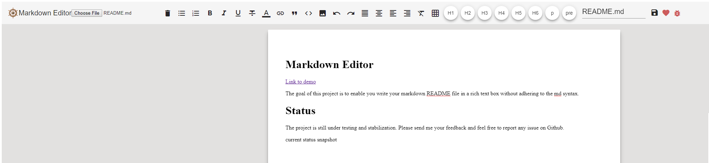

# Markdown Editor

[Link to demo](https://mdedit4.firebaseapp.com/)

The goal of this project is to enable you write your markdown README file in a rich text box without adhering to the md syntax.
# Status

The project is still under testing and stabilization. Please send me your feedback and feel free to report any issue on Github.

